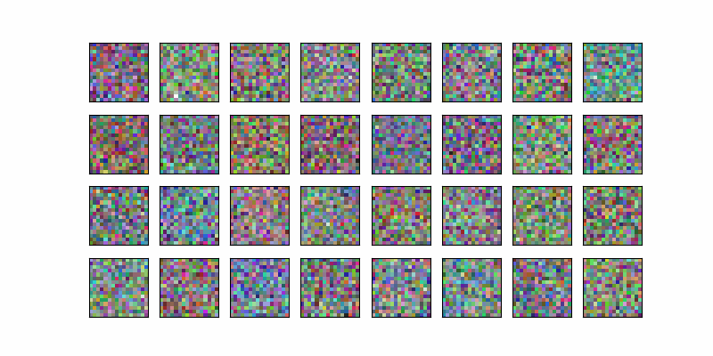
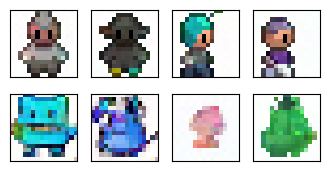
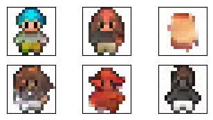

# Implementing-DDPM-DDIM

# Results:

## DDPM Content generation:

  

### DDPM Guided Content Generation:

#### Single token context:

  

#### Multi-token context:

  

## DDIM Content Generation:

  

## DDPM VS DDIM Runtime Comparison:

| Denoising algo. |     "CPU"(s)    |     "GPU"(s)    |
|-----------------|-----------------|-----------------|
|     `DDPM`      | 2min 19s / loop |  2.13 s / loop  |
|     `DDIM`      | 7.91 s / loop   |  115 ms / loop  |

