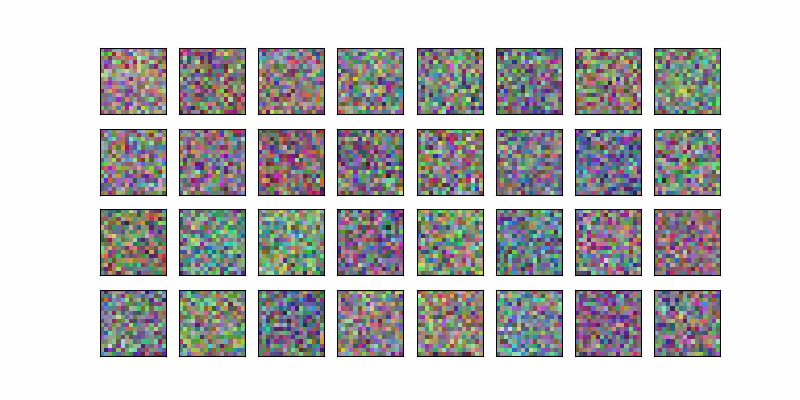

# Implementing-DDPM-DDIM for Diffusion Models
This project focuses on implementing and comparing two popular diffusion models: DDPM (Denoising Diffusion Probabilistic Model) and DDIM (Denoising Diffusion Implicit Model). The primary goal is to generate new samples and assess the differences in sampling efficiency and the quality of generated samples.

## Setup and Dependencies:
The code requires Python 3.x and the following libraries:
  - torch
  - torchvision
  - matplotlib
  - numpy
  - tqdm
  - IPython

To install the required packages, you can use:
```
pip install torch torchvision matplotlib numpy tqdm
```


# Model
The main model used is a Contextual U-Net, which is a variant of the U-Net architecture adapted to include context labels for conditional generation. Here is an overview of the main components:

- **Initial Convolutional Layer:** A residual convolutional block that processes the input image.
- **Downsampling Path:** Two levels of down-sampling using UnetDown blocks.
- **Embedding Layers:** Fully connected layers to embed timesteps and context labels.
- **Upsampling Path:** Three levels of up-sampling using UnetUp blocks.
- **Final Convolutional Layers:** Convolutional layers to map the upsampled features back to the original image channels.


## Diffusion Process

The images are generated by the above two `sampling functions`:

### DDIM Sampling
DDIM sampling removes noise using a deterministic process, leading to faster sampling compared to DDPM. The key function for DDIM sampling is denoise_ddim, which computes the denoised image at each timestep.

```
@torch.no_grad()
def sample_ddim(n_sample, n=20):
    # Implementation details
```


### DDPM Sampling
DDPM sampling adds noise back into the denoised image to avoid collapse. The function denoise_add_noise handles this by predicting noise and adding Gaussian noise back into the sample.

```
@torch.no_grad()
def sample_ddpm(n_sample, save_rate=20):
    # Implementation details
```


# Results:

- **DDIM:** Faster sampling times (115 ms per loop for 32 samples with n=25).
- **DDPM:** Slower sampling times (2.13 s per loop for 32 samples).

## DDPM Content generation:

<p align="center">
  
</p>

### DDPM Guided Content Generation:

#### Single token context:

<p align="center">
  
</p>

#### Multi-token context:

<p align="center">
  
</p>


## DDIM Content Generation:

<p align="center">
  
</p>


## DDPM VS DDIM Runtime Comparison:

| Denoising algo. |     "CPU"(s)    |     "GPU"(s)    |
|-----------------|-----------------|-----------------|
|     `DDPM`      | 2min 19s / loop |  2.13 s / loop  |
|     `DDIM`      | 7.91 s / loop   |  115 ms / loop  |


# Conclusion:

The implementation and comparison of DDPM and DDIM demonstrate that DDIM provides a significant speed advantage while maintaining similar-quality sample generation as DDPM. This makes DDIM a preferable choice for applications requiring faster sampling.
